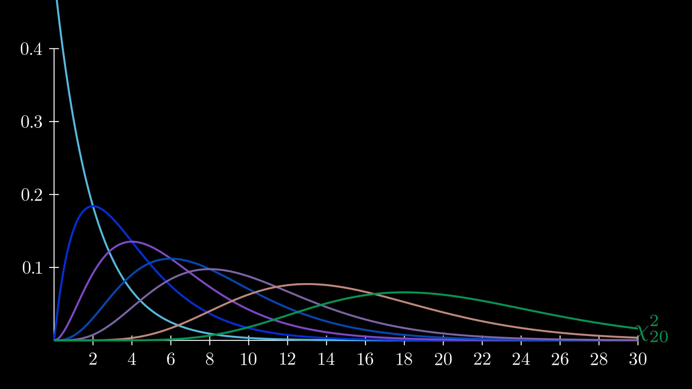

# manim-scripts
Scripts written to be run with the [manim community](https://github.com/manimCommunity/manim) library.

# Getting Started
The following list of software is recommended for successfully running these scripts:

`[REQUIRED]` Manim - the library that creates the videos.  [Instructions](https://docs.manim.community/en/stable/installation/windows.html)

`[REQUIRED for Windows]` MikTeX - LaTeX support for videos. [Download](https://miktex.org/download)

`[Optional]` Chocolatey - software to install manim on Windows.  [Download](https://chocolatey.org/install#install-step2)

`[Optional]` VS code - code editing software.  [Download](https://code.visualstudio.com/download)

Once all of the software above has been installed and this repository has been copied locally to `~\Documents\GitHub\manim-scripts\`, run the following command in a PowerShell terminal to create a video from the scripts file [STA300_scenes.py](./STA300_scenes.py).

```
PS C:\Users\yourUsername> cd .\Documents\GitHub\manim-scripts\
PS C:\Users\yourUsername\Documents\GitHub\manim-scripts> manim .\STA300_scenes.py TRevisited
```

This will create a 1080p video rendering of the scene `TRevisited` from the STA300_scenes.py file at the path: `C:\Users\yourUsername\Documents\GitHub\manim-scripts\media\videos\STA300_scenes\1080p60\ChiSquares.mp4`

[](./media/videos/STA300_scenes/1080p60/ChiSquares.mp4 "Chi Squares video")

For rapid prototyping, the flags `-p` (play) and `-ql` (quality low) can be used to accelerate render times and play video outputs immediately:
```
manim -p -ql STA300_scenes.py ChiSquares
```
